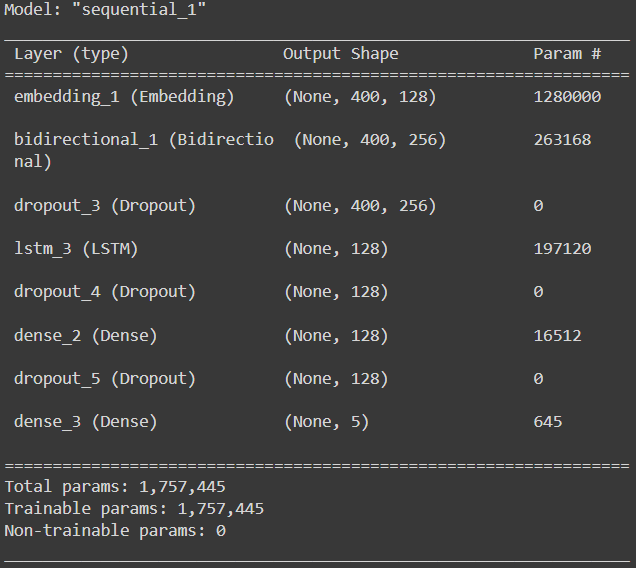
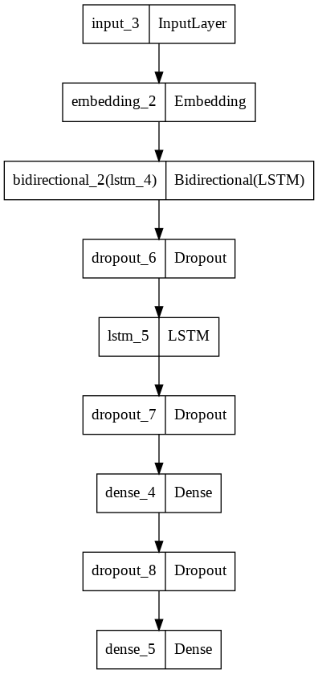
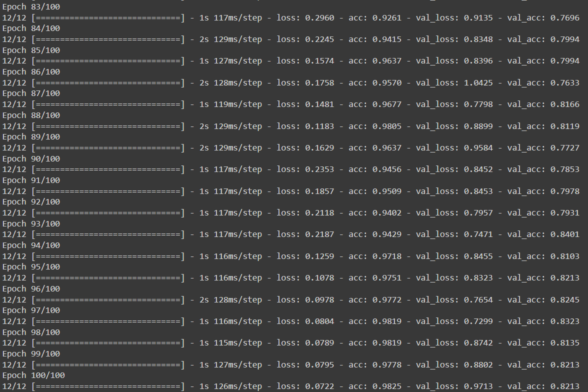
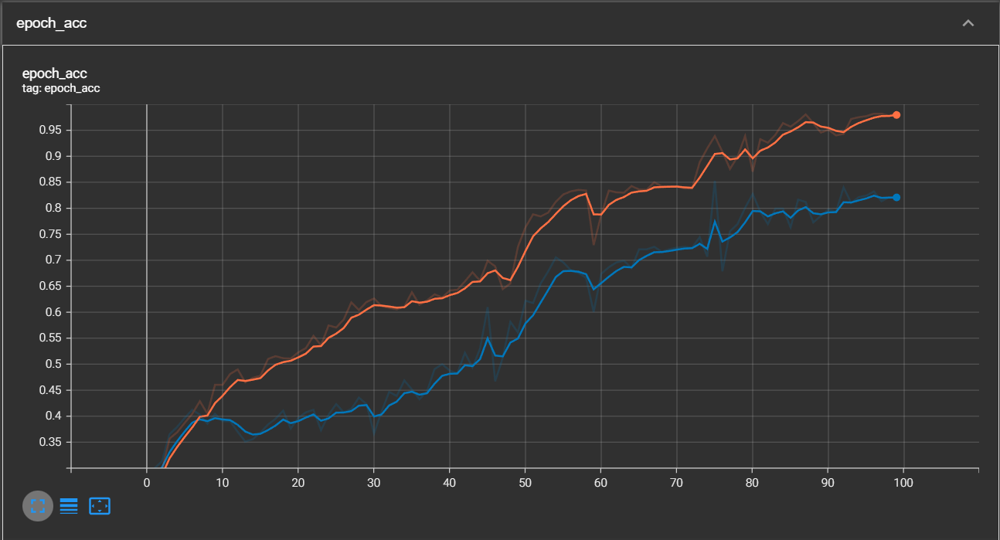
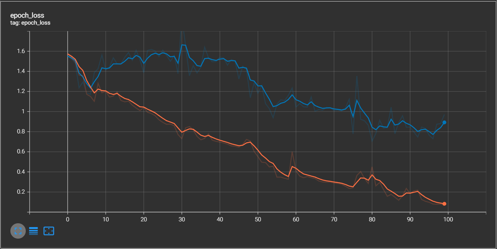
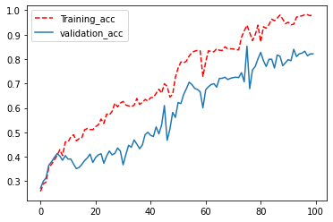
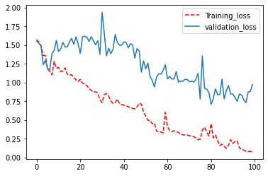
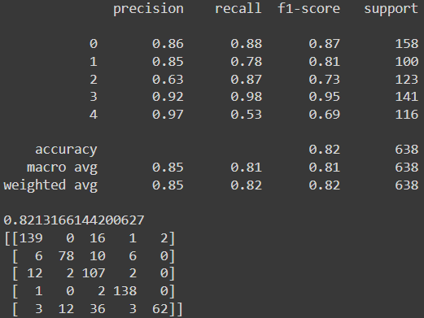

# TEXT_ANALYSIS_NLP
- 20000+ of texts from articles analyzed for 5 categorization including 'tech', 'business', 'sport', 'entertainment', 'politics'.

## ABOUT THE PROJECT
The text documents comprised of 5 categories as mentioned before which are:
1. tech
2. business
3. sport
4. entertainment
5. politics

Therefore, the categorization of the text documents into those 5 categories conducted through Deep Learning in order to avoid waste of time and resouces.

## OBJECTIVE
1. Develop a deep learning model using LSTM which can achieve accuracy of more than 70% and F1 score of more than 0.7.
2. Use TensorFlow library to develop and train the model.
3. Plot the graph using Tensorboard.

## REQUIREMENTS
1. RegEx
2. OS Module
3. JSON
4. pickle
5. Datetime
6. NumPy
7. Matplotlib
8. pandas
9. scikit-learn
10. TensorFlow

## PROJECT OVERVIEW
#### EDA (EXPLORATORY DATA ANALYSIS)
##### STEP 1) DATA LOADING
- Read the data using pandas using the link: [BBC_Text (NLP)](https://raw.githubusercontent.com/susanli2016/PyCon-Canada-2019-NLP-Tutorial/master/bbc-text.csv)
- Also make a backup for the dataset using .copy()
##### STEP 2) DATA INSPECTION
- The target column (category) comprises of 5 outputs as mentioned before: 0. tech, 1. business, 2. sport, 3. entertainment, 4. politics
- The dataset contains 99 duplicates and required to be removed.
- Fortunately, the dataset doesn't contain NaNs.
##### STEP 3) DATA CLEANING
- The duplicates were removed from the dataset.
- The text documents are already in small letters, therefore no need to convert the letters.
- Numbers needed to be removed from the text. This achieved using RegEx to replace anything besides letters with nothing. Accomplish this task using for loop!
- Then split the text, hence they will be in list. This is useful for the next step using tokenizer.
##### STEP 4) FEATURE SELECTION
- For this matter, no features needed to be selected.
##### STEP 5) DATA PREPROCESSING
- For data preprocessing, 4 steps done, which are:
1. *Tokenization*
2. *Padding and Truncating*
3. *OneHotEncoding for the Target*
4. *Train test split*

#### MODEL DEVELOPMENT
- Sequential Approach used to develop deep learning model.
- Embedding, Bidirectional, LSTM, Dropout, Dense, Input used to improve and develop the model.
- Model summary as follows:

- Hence, the developed model's architecture is as below:

#### MODEL TRAINING
- Model was trained using 128 batch_size and 100 epochs. The accuracy achieved after taraining around 82%. The result of training as follows:

- The graph were plotted on TensorBoard and found out the graph were overfitting, since the accuracy performs better than validate accuracy.
- Hence, EarlyStopping implemented to reduce and avoid overfitting.
- Below are the plotted graphs on TensorBoard and using Matplotlib:
- TensorBoard::small_orange_diamond:Train  :small_blue_diamond:Validation

- Plotted graph using Matplotlib:

#### MODEL EVALUATION

- Below are the performance of the model. Most of the F1 score for every category are varies and exceed 70% except the fifth category (politics) achieved 69%. Meanwhile, the model's accuracy achieved 82%. The model's F1 score, accuracy and confusion matrix are as follows:

#### DISCUSSION/REPORTING
- Model achieved around 82% accuracy during training.
- However the model show overfitting when the acc performs better than val_acc with acc at 0.9825 and val_acc at 0.8213.
- Therefore, EarlyStopping has been implemented.
- May increase dropout rate in future to control overfitting.
- Besides, may try with different Deep Learning architecture to improve the model. For example, implementing BERT model, transformer model or GPT3 model.

